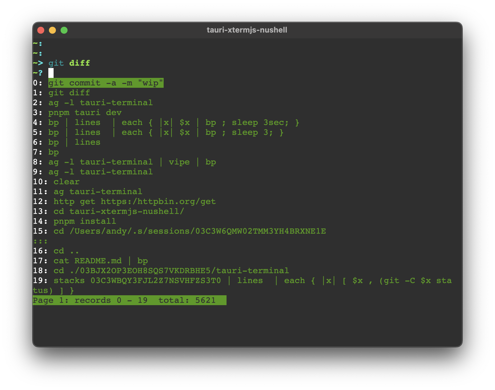

This is a fork of [tauri-terminal](https://github.com/marc2332/tauri-terminal), that
[invokes](https://github.com/marc2332/tauri-terminal/commit/0bdd4a27ee2874de12e99bccd6c91d6ec5d28fbc#diff-2f5e0a90d4195e9986f5e24928dce16b59a80a2cf30f7059b38d55bd7d1eff69R23)
the [nu](https://www.nushell.sh) binary instead of bash.

## to spin it up

```
pnpm install
pnpm tauri dev
```

## looks like



If you find this interesting, swing by the nushell
[#project-nana](https://discord.gg/RA4GXaT8DT) discord channel
